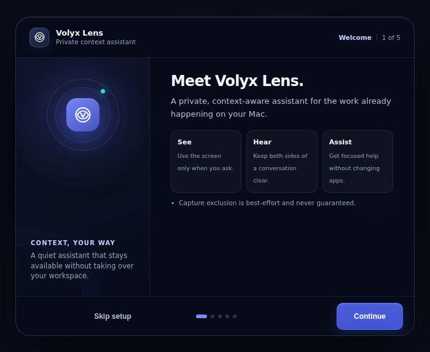
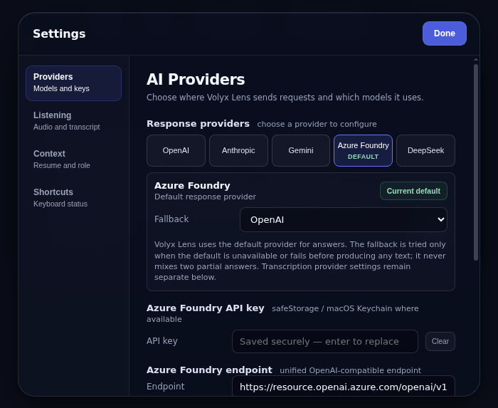
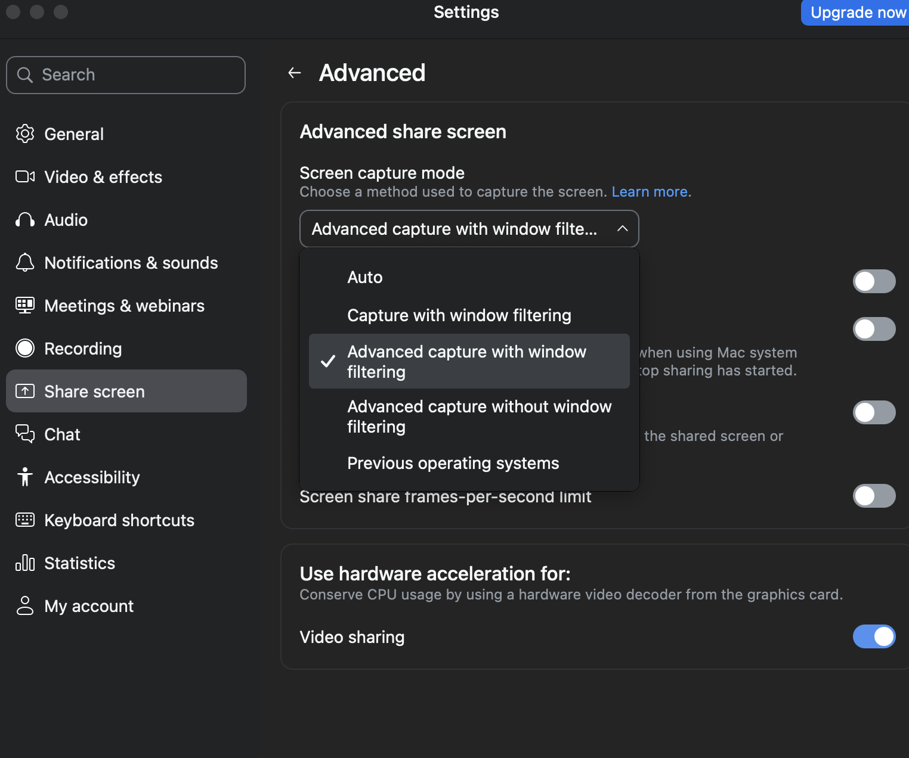

<div align="center">

# Volyx Lens

**A private, context-aware macOS assistant for your screen, voice, meetings, and coding workflows.**

Bring your own AI key and keep control of the providers you use (OpenAI · Anthropic · Google Gemini · Azure Foundry · DeepSeek · Deepgram transcription).



<sub>The current five-step onboarding experience.</sub>

</div>

---

> [!IMPORTANT]
> **Please read this first.** Volyx Lens tries to stay out of screen recordings/shares, but this is **best-effort, not guaranteed** — on macOS 15.4+ Apple can let modern capture tools see it anyway, and a phone camera always can. Using a hidden assistant during a **proctored exam, job interview, or recorded meeting** may break that platform's rules and, in some places, consent laws. Volyx Lens is built for legitimate uses — your own notes, studying, accessibility, and practice. **You are responsible for how you use it.**

---

## What it does

Volyx Lens floats a small glass panel on top of everything. It takes **three separate inputs** — your **screen**, your **microphone**, and your **meeting audio** (what the other person says) — and uses an AI model to help you in real time.

| Feature | How to trigger | What it uses |
|---|---|---|
| **Assist** | `⌘` `↵` or the *Assist* button | explicitly choose screen only, conversation only, or both |
| **Task Context** | action after *Recap*, `⌘` `⇧` `C`, or *Add screen* | docks/opens its panel and saves visible screens in memory without calling AI; included only in a later explicit screen-based request |
| **What should I say?** | button | meeting audio + your mic |
| **Follow-up questions** | button | the whole conversation |
| **Recap** | button | the whole conversation |
| **New Session** | button or type `/new` | clears transcript, generated answers, task-context screens, partials, and buffered audio context |
| **Ask anything** | type + `↵` | your screen + conversation |
| **Solve a coding problem** | `⌘` `H` | your screen only |
| **Smart** toggle | pill in the box | switches to a smarter (slower) model |

### Task Context

When an interview or browser IDE reveals files gradually, open **Task Context** from the action immediately after **Recap**, then click **Add screen** on the problem statement and again as you open useful files or test output. The panel lists metadata only—capture number, timestamp, approximate size, pin state, and local text-indexing status—through a bounded paginated view; screenshot bytes, recognized text, and hashes stay in the main process. Pin the problem statement or another important capture to protect it from ordinary eviction and prioritize it for requests. Remove deletes one selected capture, **Undo last** removes the newest capture, and **Clear** removes all captures. Click the same Task Context action to dock the panel without clearing its screens. `⌘` `⇧` `C` captures directly. Capturing is local and makes **no provider request**. There is no fixed screenshot-count limit; Volyx Lens retains compressed screens inside a 96 MB process-memory budget, deduplicates byte-identical captures with SHA-256, and uses a dependency-free 17×16 local visual fingerprint to conservatively reject near-identical captures caused by cursor, compression, or tiny overlay changes. Fingerprints stay in main-process session memory, never cross to the renderer or a provider, and fingerprint failures never block capture. On macOS, a bundled Apple Vision helper processes one saved screen at a time after capture; Add Screen returns immediately, and the panel shows Processing, character count, Failed, Unavailable, or Evicted without exposing recognized content. OCR input is limited to 8 MB, helper stdout to 512 KiB, retained text to 64 KiB per capture, and total retained OCR text to 8 MB; oldest unpinned OCR text is evicted first. OCR failures never block capture, no cloud OCR is used, and recognized text is used only for local overlap detection and screen ranking—not attached to provider requests. Adjacent code or document captures with repeated OCR lines are linked rather than rejected; the panel shows the approximate overlap or detected line range, while only each capture's non-repeated text influences relevance ranking. Volyx Lens evicts the oldest unpinned captures when needed and displays the last eviction. If pinned captures fill the budget, Volyx Lens rejects a new capture without deleting existing screens. **New Session**, **Clear**, relaunching, or quitting cancels local OCR and removes all screenshots, fingerprints, and recognized text.

A screen-based AI request attaches at most 39 saved screens plus the current screen. Before any upload involving eight or more saved screens, Volyx Lens shows the selected provider and image count and requires confirmation because multiple images can increase latency and provider cost. When more than 39 are saved, Volyx Lens prioritizes pinned captures, locally ranks non-repeated OCR text against the question and recent transcript, preserves the earliest context screen when space permits, and fills remaining slots with the newest captures. The selected screenshots are then attached in chronological order; omitted screens visibly remain local and Volyx Lens never implies they were processed. The model receives attached screens together so it can compare files. Conversation-only actions and text-only providers do not receive images. Task Context cannot read files or code that never appeared on screen. Use it only when external assistance is permitted.

It supports **live meetings** ("what should I say next?"), **screen-aware questions**, and **coding workflows** while keeping capture, routing, and provider use explicit.

---

## Install

There are two ways to install Volyx Lens. **If you're not a developer, use Option A.**

### Option A — Download the app (easiest)

1. Go to the [**Releases**](../../releases) page. Download the latest signed archive for your Mac:
   - **Apple Silicon (M1/M2/M3/M4 or newer):** `volyx-lens-<version>-mac-arm64.zip`
   - **Intel:** `volyx-lens-<version>-mac-x64.zip`
   If no release assets are listed yet, use Option B; a public binary has not been published.
2. Double-click the zip to unzip it. You'll get **`Volyx Lens.app`**.
3. Drag **`Volyx Lens.app`** into your **Applications** folder.
4. Open Volyx Lens normally. Public release assets are Developer ID signed, notarized, stapled, checksummed, and accompanied by a CycloneDX SBOM and GitHub build attestation. Do not bypass Gatekeeper for an asset that fails verification.

### Option B — Run from source (developers)

You need [Node.js](https://nodejs.org) 20+ installed. No Xcode required.

```bash
git clone https://github.com/dk3yyyy/volyx-lens.git
cd volyx-lens
npm ci
npm start
```

To build your own `Volyx Lens.app`:
```bash
npm run pack      # creates dist/mac-arm64/Volyx Lens.app
```
> Note: local builds are unsigned unless a valid Apple Developer ID certificate is installed. macOS ties permission grants to the exact build, so **rebuilding can reset mic/screen permissions**. Signed public releases still require an Apple Developer certificate and notarization credentials.

---

## First launch — the 1-minute setup

When Volyx Lens opens the first time, a **built-in tutorial** walks you through everything below. You can reopen it anytime by clicking the **Volyx Lens logo** (top-left of the pill). Here's the same thing in writing.

### Step 1 — Grant two macOS permissions

Volyx Lens can't help until macOS lets it see and hear. In the built-in tutorial, click **Request Microphone access** and **Request Screen Recording access** to trigger the native macOS permission flow. Volyx Lens does **not** use or request camera access.

If a permission was previously denied, macOS will not show the consent popup again; Volyx Lens opens the corresponding System Settings pane instead. Enable the app there, then fully quit and reopen Volyx Lens:

- **Microphone:** System Settings → **Privacy & Security** → **Microphone** → turn on **Volyx Lens**.
- **Screen Recording:** System Settings → **Privacy & Security** → **Screen & System Audio Recording** → turn on **Volyx Lens**. (This one grant covers both screenshots *and* meeting audio.)

### Step 2 — Add your AI key (bring your own)

Volyx Lens has no subscription fee, but your selected AI or transcription provider may charge for usage. Click the **`...`** button in the input box (or press `⌘` `,`) to open **Settings**. Provider tabs open one configuration at a time: select a provider, add its key and models, then click **Use as default** when that provider should answer requests.

<div align="center">
  
  <br />
  <sub>Current provider Settings. Values shown are non-secret examples from the UI test harness.</sub>
</div>

| Provider | Get a key | Notes |
|---|---|---|
| **OpenAI** | [platform.openai.com/api-keys](https://platform.openai.com/api-keys) | Realtime listening uses `gpt-realtime-whisper`; batch fallback defaults to `gpt-4o-mini-transcribe`. The key needs Realtime/audio access. |
| **Anthropic (Claude)** | [console.anthropic.com](https://console.anthropic.com) | Defaults to `claude-haiku-4-5` and `claude-sonnet-5`. Great for screen and coding help. Claude has no speech-to-text, so add an OpenAI or Gemini key too if you want listening features. |
| **Google Gemini** | [aistudio.google.com/apikey](https://aistudio.google.com/apikey) | Defaults to stable `gemini-3.5-flash` and `gemini-2.5-pro`. One key handles chat and batch transcription. |
| **Azure Foundry** | [ai.azure.com](https://ai.azure.com) | Enter the resource key, resource endpoint (Volyx Lens adds `/openai/v1` when needed), and exact deployment names. Azure `gpt-realtime-whisper` deployments are supported for listening. |
| **DeepSeek** | [platform.deepseek.com](https://platform.deepseek.com) | Uses the official `https://api.deepseek.com` endpoint. Defaults to `deepseek-v4-flash` and `deepseek-v4-pro`. DeepSeek is text-only here, so meeting/transcript modes work without screenshots; screen-only analysis needs a vision-capable provider. |
| **Deepgram** | [console.deepgram.com](https://console.deepgram.com) | Realtime transcription only. Uses pinned `@deepgram/sdk` with Nova-3, interim results, continuous 24 kHz PCM (including silence while listening), and 300 ms endpointing. The key remains in the Electron main process. |

You can also choose one optional **Fallback** response provider. Volyx Lens uses it when the default is not configured, cannot satisfy a required screen request, or fails before emitting any answer text. Volyx Lens does **not** switch providers after partial text has appeared, preventing mixed or duplicated answers. The response panel identifies the provider actually used. A fallback must have its own valid key and model configuration.

Each response-provider tab includes an explicit **Test connection** action for either the Fast or Smart model. The test saves the current settings and sends one minimal text-only request capped at 64 output tokens; it never includes screenshots, transcript, Task Context, resume, job description, or fallback routing, but a small provider charge may apply. Results report the tested provider, tier, model/deployment, vision capability, latency, and—in Azure's case—whether the configured URL is a Foundry resource, Azure OpenAI resource, or project-scoped endpoint. Credentials and endpoint names are never returned to the renderer.

The response provider and transcription provider are independent. Realtime listening can use direct OpenAI, an Azure Foundry `gpt-realtime-whisper` deployment, or Deepgram Nova-3. Batch fallback uses OpenAI Audio or Gemini when configured.

Under **Settings → Transcription**, choose:

- **Realtime** (recommended) — streams 24 kHz PCM. OpenAI commits turns using local voice activity detection; Azure streams continuously and commits fixed three-second windows; Deepgram streams continuously and returns interim/final Nova-3 results. When microphone and system audio are both enabled, Volyx Lens holds mic PCM for 250 ms before echo inspection so the native system-audio reference can catch up.
- **Realtime provider** — choose OpenAI, Azure Foundry, or Deepgram. Azure reuses the response-provider key and endpoint by default, or accepts an optional separate Realtime resource key and endpoint. Deepgram uses its own securely stored key.
- **Azure deployment** — enter the exact deployment name assigned to your Azure `gpt-realtime-whisper` model.
- **Deepgram model** — defaults to `nova-3`; keep this unless a tested compatible streaming model is required.
- **Browser mic processing** — enabled by default and applies Chromium echo cancellation, noise suppression, and automatic gain control. For speaker-bleed diagnosis, replay the same source once enabled and once disabled; restart listening after each change and compare Diagnostics peak correlation/acoustic suppression. Disabling it can increase room noise.
- **Batch** — uses the configured OpenAI fallback model or Gemini in short chunks.
- **Language** — leave blank for automatic behavior, or enter a short language hint such as `en`, `fr`, or `de`.
- **OpenAI/Azure delay** — lower values show text sooner; higher values trade latency for more context. Deepgram uses its explicit streaming endpointing configuration instead.
- **Microphone / sensitivity / silence** — select the input device and tune local speech boundaries.
- **Cost warning / session limit** — warn on long sessions and stop automatically at the configured limit.

If a Realtime session cannot connect, Volyx Lens switches to batch transcription for that listening session instead of reconnecting in a loop. The staged implementation and macOS validation checklist are documented in [`docs/voice-upgrade-plan.md`](docs/voice-upgrade-plan.md).

Keys are migrated out of plaintext settings and protected through Electron `safeStorage` (macOS Keychain on macOS). The renderer receives only “present / missing” status, never saved credential values. If secure storage is unavailable, Settings explicitly reports a plaintext fallback. Screen images and response prompts go to the selected response provider. When listening is enabled, microphone/system audio goes separately to the configured OpenAI, Azure, or batch transcription service; resulting text can then be included in prompts sent to the selected response provider. Volyx Lens has no intermediary server.

### Personal context — resume/CV and job description

Settings can import one **Resume / CV** and one **Job Description** in PDF, DOCX, UTF-8 TXT, or Markdown format. Files are limited to 5 MB; PDF extraction is limited to 50 pages, DOCX archives are bounded, and extracted text is capped at 50,000 characters per document. Scanned image-only PDFs are not supported yet.

Volyx Lens stores only the extracted text, original filename, and document status—never the original path or raw file. Extracted text is protected with `safeStorage` / macOS Keychain when available; Settings clearly warns if the operating system only provides a local `0600` plaintext fallback. Documents can be previewed, disabled independently, replaced, or removed without changing the original file.

Enabled personal context is available only to answer-oriented actions: Assist, What should I say?, Follow-up questions, and typed questions. Recap and the dedicated coding solver do not receive it. Volyx Lens sends no personal-context excerpt when the request has no relevant terms or recognizable personal/career intent; otherwise it selects bounded relevant excerpts rather than automatically sending the whole document. Every response that uses it displays the document source and selected provider. Documents, screenshots, transcripts, webpages, and editor content are treated as untrusted reference data: embedded instructions are ignored, unrelated personal information must not be revealed, factual personal claims must be supported by the documents or conversation, and missing experience must be disclosed rather than invented.

### Transcript workspace and diagnostics

While listening, Volyx Lens groups backend transcription chunks into conversational turns with timestamps and separate **You** / **Them** labels. Consecutive chunks from the same channel—including punctuation boundaries, fixed provider commit windows, silence, and breath pauses—update one stable text box. A new box starts only when the channel changes between **You** and **Them**. Partial speech updates the active speaker box as visually distinct “Listening…” text and is replaced by confirmed text rather than exported. To reduce speaker leakage, Volyx Lens conservatively compares substantial opposite-channel segments received within eight seconds; when they are at least 82% similar, it keeps the direct **Them/system-audio** segment and removes the duplicate **You/microphone** segment without discarding other text in that conversation turn. Short acknowledgements, same-channel repetitions, and dissimilar speech are preserved. The workspace can copy an individual turn or the full confirmed transcript, clear it with confirmation, or export it locally as TXT, Markdown, or structured JSON through a native save dialog. Exported files are created with owner-only permissions where the operating system supports them.

The expandable **Diagnostics** panel shows session duration, transcription mode/provider, channel connection count, last latency, response-provider routing, transcript counts, and the last sanitized transcription state. **Copy diagnostics** deliberately excludes API keys, endpoints, raw audio, screenshots, personal-context text, and transcript text.

Answer-oriented actions use a bounded recent excerpt rather than sending an arbitrarily large grouped turn: normal conversation context is capped at approximately 16,000 characters and explicitly marks omitted history. A normal Recap uses up to approximately 48,000 characters. Every response request can be stopped from the composer, is aborted by New Session/relaunch/quit, and has a two-minute hard timeout; canceled requests never start the fallback provider. Provider failures are reduced to actionable sanitized messages rather than exposing raw SDK errors. Longer meetings can use sequential bounded part summaries plus a final recap; before that multi-request path runs, Volyx Lens displays the exact request count and requires confirmation because provider charges may apply. Extremely long sessions are capped at 12 evenly sampled parts.

When local **Detect questions** is enabled, Volyx Lens identifies likely questions from Them without contacting an AI provider and displays a dismissible **Draft answer** suggestion. No model request occurs until that button is clicked.

### Step 3 — Capture exclusion in Zoom

Volyx Lens requests best-effort exclusion from many screen-capture tools. **Zoom** has a specific setting that decides whether it respects that request:

> **Zoom → Settings → Share Screen → Advanced → Screen capture mode → choose "Advanced capture with window filtering."**

<div align="center"></div>

**Why:** the *"...with window filtering"* modes tell Zoom to leave out windows that mark themselves as private — which is exactly what Volyx Lens does. The **"Advanced capture without window filtering"** mode grabs the raw screen and **will show Volyx Lens**, so avoid it.

---

## How to use it

- **`⌘` `↵` — Assist.** The do-the-smart-thing key. On a coding problem it solves it; in a conversation it tells you what to say. Works from anywhere.
- **`⌘` `H` — Solve what's on screen.** Screenshots a coding problem and returns the approach, code, and time/space complexity.
- **Start Listening / Stop Listening** (top bar) — controls meeting transcription. The mint dot means it's live. Sleep, screen lock, shutdown, and the configured session limit stop capture through the main process; wake/unlock never restart it automatically.
- **Transcript workspace** — review timestamped You/Them turns, copy or clear the session, export TXT/Markdown/JSON, and open sanitized diagnostics.
- **New Session** (top bar), or type **`/new`** — clears the previous conversation context so Assist and Recap cannot mix unrelated meetings. If listening is active, capture continues in a fresh transcription session.
- **Type a question** in the box and press `↵` to ask about your screen or conversation.
- **Personal context** — import a resume/CV and optional job description in Settings. Enable only the documents you want used; Volyx Lens labels every answer that sends relevant excerpts to the selected provider.
- **Smart** — flip it on for a smarter, more thorough model; off for fast and cheap.
- **Hide** collapses the panel to just the top bar. Drag Volyx Lens around by the **top pill**.
- **Red power button** — immediately stops capture, clears in-memory session audio/transcript data, and quits Volyx Lens. The keyboard shortcut is `⌘` `⇧` `X`.

Settings reports whether each global shortcut registered successfully. If macOS or another application owns one, Volyx Lens marks it unavailable without claiming which application caused the conflict, provides the equivalent Assist, Solve, Add screen, or Quit button, and can retry unavailable registrations without disturbing shortcuts that are already working.

The panel is see-through and click-through — the empty space around it never blocks the app behind it.

---

## How it works (under the hood)

Volyx Lens is an [Electron](https://www.electronjs.org/) app. Everything runs locally except the calls to your chosen AI provider.

**The three inputs are kept completely separate:**
- **Screen** — captured with Electron's `desktopCapturer` (full-resolution screenshots, taken only when a feature needs one).
- **Your mic ("You")** — `getUserMedia` → measured device sample rate → deterministic 24 kHz mono PCM resampling → transcribed.
- **Meeting audio ("Them")** — `getDisplayMedia` loopback capture → the same measured-rate 24 kHz resampling, kept on its own channel so Volyx Lens knows *who* said what.

With Realtime enabled, each enabled audio channel gets its own `gpt-realtime-whisper` WebSocket session with the selected transcription provider. Azure uses the GA resource route `wss://<resource-host>/openai/v1/realtime?intent=transcription`, authenticates with the `api-key` header, streams continuously, and commits fixed three-second windows. OpenAI uses bounded local voice activity detection to commit turns after silence. Disable Mic or System in Settings when that source is not needed to avoid opening an unnecessary billable session. Partial transcripts stream into the active speaker box; confirmed chunks are grouped into conversational You/Them turns.

Optional offline batch transcription can run an externally installed `whisper-cli` before any cloud batch provider. It is disabled by default and requires absolute `VOLYX_LENS_WHISPER_CLI` and `VOLYX_LENS_WHISPER_MODEL` environment paths at launch. The executable is never selected by the renderer; Volyx Lens launches it without a shell, with a minimal environment, bounded output/time, private temporary audio files, serialized jobs, and lifecycle cancellation. **Cloud fallback is separately disabled by default in offline mode**, so local failure cannot silently upload audio. Enabling Cloud fallback explicitly allows local → OpenAI → Gemini batch ordering. Volyx Lens does not download, bundle, sign, or prove the network behavior of third-party Whisper binaries/models.

Azure prices `gpt-realtime-whisper` hourly. Because Volyx Lens keeps **You** and **Them** isolated in separate WebSocket sessions, Azure can count them as two concurrent billable sessions. Verify the current rate and quota in your Azure resource before long sessions.

**Capture exclusion** is primarily a macOS window flag: `setContentProtection(true)`, which sets `NSWindowSharingNone`. This asks the window server to exclude Volyx Lens from screen-capture streams. The packaged app also uses `LSUIElement`, hides its Dock icon, adopts accessory activation policy, stays out of Mission Control, and gives the overlay a neutral window-list title. These reduce accidental visibility in ordinary UI surfaces; they do **not** hide the signed bundle, process, permissions entry, or helper processes from system inspection. On macOS 15.4+ Apple lets some capture tools ignore content protection, so exclusion remains best-effort (see the disclaimer at the top).

```text
main process ──┬─ overlay window (frameless, transparent, always-on-top, content-protected)
               ├─ screenshot capture (desktopCapturer)
               ├─ speech-to-text (Realtime Whisper / batch fallback) ── "You" + "Them"
               └─ LLM streaming (OpenAI / Anthropic / Gemini / Azure Foundry / DeepSeek)
renderer ──────┴─ the glass UI + mic capture + system-audio loopback
```

---

## Troubleshooting

**"It says give access, but I already gave access."**
You probably granted an older build. Because the app is ad-hoc signed, a rebuild changes its identity and macOS stops honoring the old grant (the checkmark can linger). Toggle Volyx Lens **off and on** in System Settings → Screen Recording, or remove and re-add it.

**A feature returns "403" / "no access to model."**
Your API key is restricted. Most often it's an OpenAI **project key that only allows chat models** — it works for screen/coding help but 403s on transcription (Whisper). Fix: enable audio/Whisper on the key, use an unrestricted key, or add a Gemini key (Volyx Lens falls back to it for transcription).

**Listening does nothing / no transcript.**
Check Settings has the correct Realtime provider. For Azure, verify the Azure key, official resource endpoint, and exact `gpt-realtime-whisper` deployment name. Leave Language blank for automatic detection; `auto` and `automatic` are normalized to a blank hint. Stop Listening, then click **Test Live Mic**: Volyx Lens records five seconds, resamples the measured device rate to 24 kHz, sends one temporary mic stream, requires an actual transcript, and reports endpoint host, deployment, audio duration/bytes, commit count, and source/target rates without exposing credentials. The audio is discarded immediately. **Test Connection** remains a faster no-audio handshake check, but it does not prove that audio transcription works. Provider session billing may apply. Transcription-setting changes apply on the next listening session. Stop and restart listening. For a terminal-based no-audio diagnostic using the same saved settings, run `npm run test:azure-realtime`; it never prints the key and closes immediately after Azure accepts or rejects the transcription session. If the provider still fails, launch the packaged binary from Terminal and inspect the sanitized `[stt:realtime] error` line.

To test Azure safely without streaming microphone audio, stop listening, close Volyx Lens, and run `npm run test:azure-realtime`. The probe reads Volyx Lens's local settings, opens one short Azure transcription session, reports a sanitized handshake/session result, and closes. It never prints the API key, but the short session can still be billable.

**Volyx Lens shows up in my Zoom share.**
Set Zoom's **Screen capture mode** to *"Advanced capture with window filtering"* (see Step 3). And remember: on macOS 15.4+ this can still fail — it's best-effort.

**"Volyx Lens is damaged and can't be opened."**
Run `xattr -cr /Applications/Volyx\ Lens.app` in Terminal once (see Install → Option A).

---

## Privacy

- No accounts, no servers, no telemetry. Volyx Lens collects nothing.
- API keys are protected with Electron `safeStorage` (macOS Keychain on macOS); `volyx-lens-data.json` stores encrypted blobs rather than renderer-readable values. Settings warns when only a plaintext fallback is available.
- Resume/job-description imports persist only bounded extracted text plus the original filename, never the original path or raw file. `personal-context.json` is encrypted with safeStorage when available and mode `0600`; Settings warns before use when only plaintext fallback storage is available.
- Enabled personal documents are not uploaded at import time. Relevant bounded excerpts are sent to the selected response provider only when an answer-oriented action runs, and the UI identifies the source and destination provider.
- Screenshots and response prompts go to the selected LLM provider only when a feature runs.
- When listening is active, microphone/system audio goes to the selected transcription service: Azure Realtime, OpenAI Realtime/Audio, or Gemini. When optional offline mode is enabled, audio stays local unless **Cloud fallback** is separately enabled. The resulting transcript may then be sent to the selected response provider only when an answer action runs; question detection itself is local.
- Audio and screenshots are not persisted by Volyx Lens; the current transcript remains in memory until the session ends or the kill switch clears it.

## Security and releases

- Renderer processes run with Chromium sandboxing, context isolation, no Node integration, a restrictive CSP, denied popup/navigation requests, and bounded IPC payloads.
- Packaged application code is stored in ASAR and macOS builds enable Hardened Runtime with the minimum Electron/audio entitlements in `build/entitlements.mac.plist`.
- CI runs tests, both Electron UI harnesses, syntax checks, a repository secret scan, a low-severity dependency audit, package builds, and a deterministic packaged-renderer readiness check.
- `npm audit` should report zero known vulnerabilities before release.

Local packaging can be verified with `npm test && npm run check:syntax && npm run security:secrets && npm run release:check && npm run pack`. A publicly distributed macOS build still requires credentials that are not stored in this repository: a Developer ID Application certificate (`CSC_LINK` / `CSC_KEY_PASSWORD`) plus Apple notarization credentials (`APPLE_ID`, `APPLE_APP_SPECIFIC_PASSWORD`, and `APPLE_TEAM_ID`, or `APPLE_API_KEY`, `APPLE_API_KEY_ID`, and `APPLE_API_ISSUER`). `npm run release:mac` fails closed when these variables are absent and always passes `--publish never`. Pushing a version tag such as `v0.2.0` starts the GitHub release workflow: it builds Intel and Apple Silicon archives, verifies renderer readiness, signature, notarization staple, Gatekeeper assessment, and architecture, then generates portable SHA-256 files, CycloneDX SBOMs, and separate provenance/SBOM attestations before publishing the GitHub Release. The workflow references the `macos-release` environment, but required reviewers and deployment restrictions must be configured in the repository’s GitHub Environment settings before any version tag is pushed.

## License

Copyright © 2026 Joshua Nwachinemere.

Volyx Lens is source-available under the [PolyForm Noncommercial License 1.0.0](LICENSE.md). Personal and other noncommercial use is permitted under its terms. Commercial use, resale, paid redistribution, and use in a commercial product or service require a separate licence from VolyxAI.

Commercial licensing: joshua@volyxai.com

## Contributing

Issues and PRs welcome. Volyx Lens is intentionally small and readable — `main.js` (app + capture + AI), `renderer/` (the UI), `src/` (providers). No build step for the source (plain HTML/CSS/JS).
