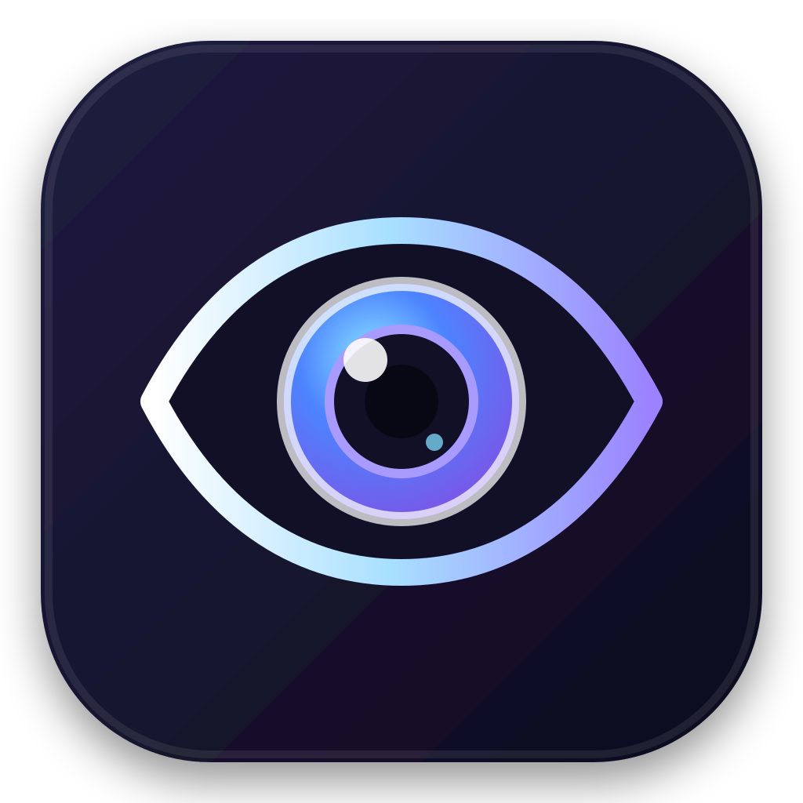
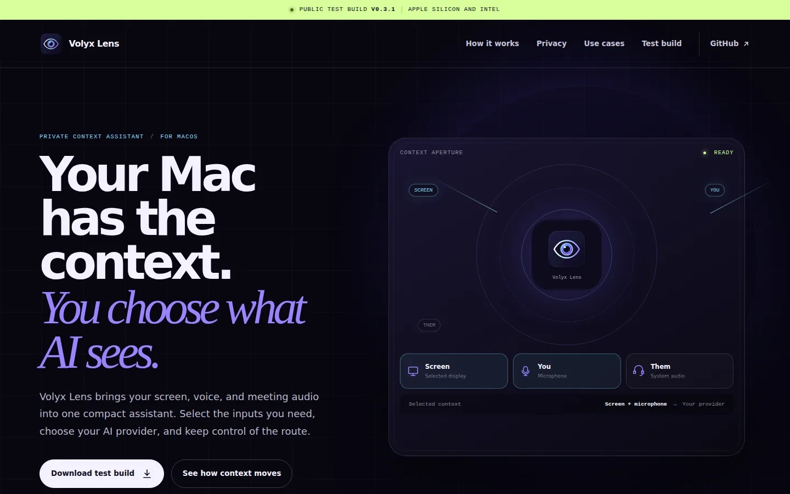
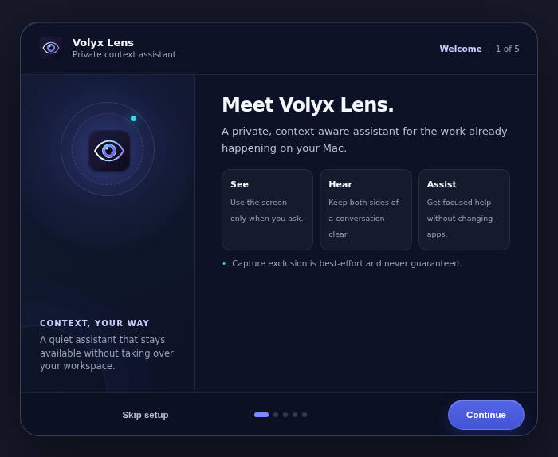
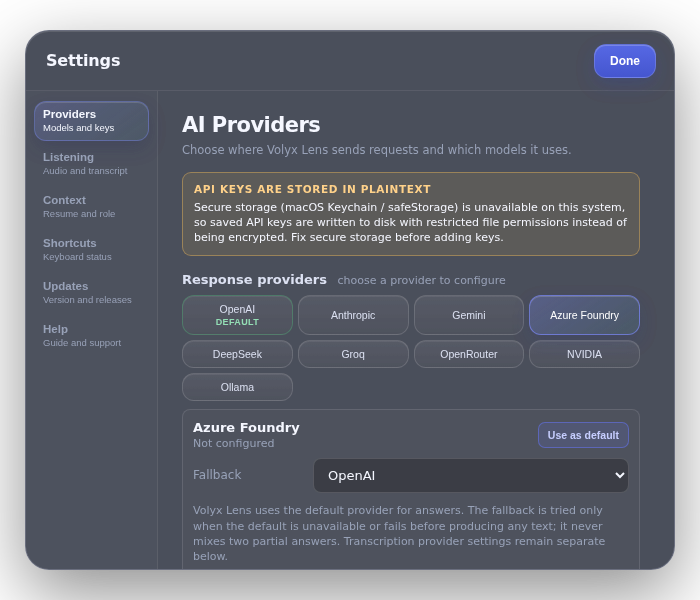
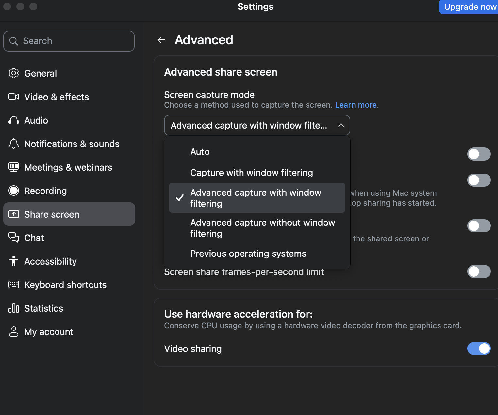
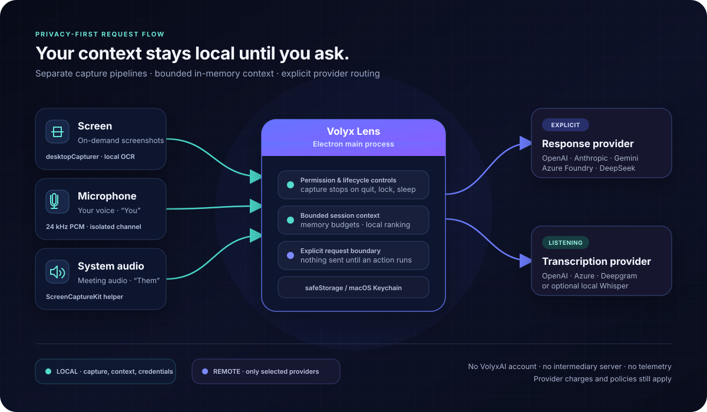

<div align="center">



# Volyx Lens

**Private, context-aware AI assistant for macOS and Windows, hidden from most screen shares.**

Use your screen, voice, meeting audio, and saved Task Context without routing requests through a Volyx Lens-operated server. Bring your own AI provider and choose what leaves your computer. The overlay marks itself as a protected window via `setContentProtection(true)`, `NSWindowSharingNone` on macOS and the OS capture-exclusion flag on Windows, so Volyx Lens stays out of most screen-recording and screen-share tools (Google Meet, Microsoft Teams, and QuickTime by default; Zoom with advanced window filtering).

[**Explore the live site**](https://volyxlens.pages.dev/) · [Download](#download) · [Product tour](#product-tour) · [Architecture](#how-it-works) · [Privacy](#privacy-and-security)

<br />

<a href="https://volyxlens.pages.dev/">
  
</a>

<sub>Live product site: <a href="https://volyxlens.pages.dev/">volyxlens.pages.dev</a></sub>

</div>

---

> [!IMPORTANT]
> **Capture exclusion is best-effort, never guaranteed.** Modern macOS or Windows capture tools may still show Volyx Lens, and a physical camera always can. Do not use hidden assistance where it violates exam, interview, workplace, platform, recording-consent, or local-law requirements. Volyx Lens is intended for legitimate personal notes, accessibility, study, practice, and permitted work.

## Why Volyx Lens

Volyx Lens is a compact glass overlay, a private AI assistant for macOS and Windows, that can use three intentionally separate inputs:

- **Screen:** screenshots are captured only for an explicit screen-based action.
- **Microphone / “You”:** your voice is transcribed on its own channel.
- **System audio / “Them”:** a native ScreenCaptureKit helper captures meeting audio on a separate channel.

Nothing is routed through a Volyx Lens-operated server. Provider requests go directly from the app to the AI or transcription provider you configure.

### Highlights

- **Screen-aware assistance:** ask about the visible screen, a conversation, or both.
- **Separated meeting transcript:** stable timestamped **You** and **Them** turns.
- **Task Context:** save multiple screens locally, pin important captures, deduplicate near-identical views, and attach a bounded relevant set only when you explicitly ask.
- **Meeting detection:** opt-in detection flags a sustained two-sided conversation while listening, tags the session, and shows a "Meeting in progress" indicator. Local and in-session only: no audio watcher, no disk writes, no model calls.
- **Meeting history:** opt-in on-device history saves meetings with a meeting badge, search, notes, and Markdown/TXT/JSON export.
- **Meeting notes:** generate structured meeting notes for saved records using your configured provider, with long-meeting confirmation before paid requests.
- **Provider choice:** OpenAI, Anthropic, Gemini, Azure Foundry, DeepSeek, Groq, OpenRouter, NVIDIA, or a local Ollama server for responses; OpenAI, Azure, Deepgram, Azure AI Speech, or optional local Whisper for transcription.
- **Transcription language:** pick a language or let providers auto-detect; the selection is honored per job and normalized for cloud and local Whisper routes.
- **Personal context:** import a resume/CV and job description with bounded extraction and relevance selection.
- **Local controls:** clear sessions, export transcripts, inspect sanitized diagnostics, and stop capture immediately.
- **Native macOS and Windows behavior:** compact draggable overlay, edge-aware expanded docking, Keychain-backed credential storage, and best-effort capture exclusion.
- **Capture exclusion:** the overlay is marked private via `setContentProtection(true)` (`NSWindowSharingNone` on macOS), so it stays out of most screen recordings and screen shares on both platforms without hidden-window tricks or a special capture mode.

## Product tour

These captures come from the current Electron UI test harness. Provider values shown in Settings are sanitized examples.

<table>
  <tr>
    <td width="50%" align="center">
      <a href="docs/onboarding-welcome-eye.png">
        
      </a>
      <br />
      <sub><strong>Guided onboarding</strong>: five focused steps for permissions, providers, sharing, and readiness.</sub>
    </td>
    <td width="50%" align="center">
      <a href="docs/settings-providers.png">
        
      </a>
      <br />
      <sub><strong>Provider control</strong>: choose the default and fallback without exposing stored secrets to the renderer.</sub>
    </td>
  </tr>
</table>

## Download

### Current release: v0.4.0

v0.4.0 is an **Apple Developer ID-signed and notarized production release**. It launches without Gatekeeper workarounds and supports one-click in-app updates.

| Mac | Installer |
|---|---|
| **Apple Silicon:** M1, M2, M3, M4, or newer | `volyx-lens-0.4.0-mac-arm64.dmg` |
| **Intel** | `volyx-lens-0.4.0-mac-x64.dmg` |

**[Open the v0.4.0 release and download the matching DMG →](https://github.com/dk3yyyy/volyx-lens/releases/tag/v0.4.0)**

SHA-256 checksum files, ZIP packages, and SBOMs are included in the release.

### Install the DMG

1. Download the DMG matching your Mac architecture.
2. Open it and drag **Volyx Lens** into **Applications**.
3. Launch **Volyx Lens** normally: the signed and notarized build opens without right-click workarounds.
4. Grant Microphone and Screen & System Audio Recording access when prompted.

Ad-hoc test builds remain available under their own pre-release tags for early validation.

## What it can do

| Action | Trigger | Context used |
|---|---|---|
| **Assist** | `⌘` `↵` or Assist | screen, conversation, or both (you choose) |
| **Solve what’s on screen** | `⌘` `H` | current screen |
| **Add Task Context screen** | `⌘` `⇧` `C` or Add screen | local capture only; no AI request |
| **What should I say?** | action button | conversation transcript |
| **Follow-up questions** | action button | conversation transcript |
| **Draft answer** | button on a detected question | conversation transcript |
| **Auto-assist** | opt-in Setting (off by default): auto-drafts replies to confidently detected questions; cooldown and confidence are configurable | conversation transcript |
| **Recap** | action button | bounded meeting transcript |
| **Detect meetings** | opt-in Setting (off by default): tags a sustained two-sided conversation while listening, with a "Meeting in progress" indicator | finalized transcript turns only, in memory |
| **Save meeting history** | opt-in Setting (off by default): keeps the session record on device when listening stops | transcript + meeting flag |
| **Search meetings** | history browser | on-device meeting history |
| **Generate meeting notes** | button on a saved meeting | saved transcript through your provider |
| **Ask anything** | type and press `↵` | selected screen/conversation context |
| **New Session** | `/new` or New Session | clears in-memory session context |
| **Emergency quit** | `⌘` `⇧` `X` or power button | stops capture and clears session media context |

The **Smart** toggle selects the configured higher-capability model. Settings reports whether each global shortcut registered successfully and keeps equivalent visible buttons available.

On Windows, press **Ctrl** wherever **⌘** appears in this table. Volyx Lens relabels its keyboard-shortcut hints automatically on Windows.

## Setup

### 1. Grant macOS permissions

Volyx Lens requests only the permissions its capture features need; it does not request camera access.

- **Microphone:** System Settings → Privacy & Security → **Microphone**
- **Screen and meeting audio:** System Settings → Privacy & Security → **Screen & System Audio Recording**

If access was previously denied, enable Volyx Lens in System Settings, then fully quit and reopen it. macOS associates permission grants with the effective app identity, so replacing an ad-hoc build can require granting access again.

### 2. Configure providers

Open Settings with `⌘` `,` or the `…` button. Choose a response provider, enter its key and model/deployment names, then select **Use as default**. An optional fallback provider is used only when it is capable of the request and the default fails before producing answer text.

Each provider stores separate **Fast** and **Smart** model/deployment names, so the Smart toggle switches tiers without extra configuration. If your fast and smart models live on different APIs, the per-provider **Tier API keys** fields (Fast key / Smart key) let each tier use its own key, and the **Endpoint overrides** fields (Fast URL / Smart URL) route each tier to its own OpenAI-compatible base URL; leaving either blank uses the shared provider key / default endpoint. Tier keys apply to Azure, DeepSeek, Groq, NVIDIA, and OpenRouter. Azure endpoint overrides still pass through official-endpoint validation.

| Provider | Role | Configuration notes |
|---|---|---|
| **OpenAI** | responses + transcription | API key; compatible response and audio models |
| **Anthropic** | responses | API key; transcription requires another provider |
| **Google Gemini** | responses + batch transcription | Gemini API key |
| **Azure Foundry** | responses + realtime transcription | resource key, official resource endpoint, and exact deployment names |
| **DeepSeek** | text responses | screen analysis requires a vision-capable default/fallback |
| **Groq** | text responses | API key; fast Llama models served on Groq's LPU |
| **OpenRouter** | responses | API key; routes to many hosted models with one key |
| **NVIDIA** | responses | API key from build.nvidia.com; OpenAI-compatible Nemotron and hosted open models (`https://integrate.api.nvidia.com/v1`); vision requires a VLM model (e.g. `meta/llama-3.2-11b-vision-instruct`) |
| **Ollama** | local responses | no key; local server with the OpenAI-compatible API (`http://localhost:11434/v1`); pull a model first |
| **Deepgram** | realtime transcription | dedicated key; Nova streaming models |
| **Azure AI Speech** | realtime transcription | Speech resource key and region (bare region name, e.g. `eastus`); no model name required |
| **Local Whisper** | optional offline batch transcription | in-app whisper.cpp model download; audio transcribed in memory; disabled by default |

Choose a key that covers the features you use. A restricted OpenAI project key that only allows chat returns `403` on transcription. Anthropic has no speech-to-text, so pair it with an OpenAI, Gemini, Deepgram, Azure, or local Whisper key for listening. Gemini covers chat and transcription with one key.

Keys stay in the Electron main process and are protected with `safeStorage` / macOS Keychain where available. The renderer receives credential status, not stored secret values. Settings warns if secure storage is unavailable.

### 3. Configure Zoom capture filtering

For Zoom, select:

**Settings → Share Screen → Advanced → Screen capture mode → Advanced capture with window filtering**

<div align="center">
  
</div>

This asks Zoom to respect Volyx Lens’s protected-window flag. It is still best-effort and may not work with every macOS or capture-tool version.

## Task Context

Task Context is for work revealed across multiple screens, for example a problem statement, source files, and test output.

- **Add screen** saves a compressed capture in bounded process memory without contacting a provider.
- Exact SHA-256 and a local visual fingerprint reduce duplicate captures.
- Optional Apple Vision OCR runs locally and is used for overlap detection and relevance ranking; recognized text is not sent as a separate provider payload.
- Pinning protects important screens from ordinary eviction and prioritizes them for later requests.
- Remove, Undo last, Clear, and New Session provide explicit lifecycle control.
- A screen request attaches at most **39 saved screens plus the current screen**. Before eight or more saved screens are uploaded, Volyx Lens shows the selected provider and image count and requires confirmation.
- Screens that are not selected remain local and are not presented as processed.

Task Context cannot read files or code that never appeared on screen. Use it only when external assistance is permitted.

## Meetings

Meeting features are opt-in from Settings → Listening, and they are local and in-session only.

- **Detect meetings** looks for a sustained two-sided conversation between the Mic and System channels while listening, then shows a subtle "Meeting in progress" indicator and tags the session as a meeting. Detection runs only on finalized in-memory transcript turns: no background audio watcher, no disk writes, and no AI requests.
- **Save meeting history** keeps the session record on device when listening stops (capture stop, new session, or app quit). Saved records are searchable in the history browser and show a meeting badge when the session was detected as a meeting.
- **Export** a saved record as Markdown, TXT, or structured JSON through a native save dialog.
- **Generate meeting notes** turns a saved transcript into structured notes using your configured provider. Long meetings need multiple model requests and require explicit confirmation before paid requests are made.

History is stored on device and cleared with the Clear history action; it is never uploaded to a Volyx Lens-operated server.

## How it works

<div align="center">
  
</div>

Volyx Lens is an Electron application with a sandboxed renderer and a privileged main process:

1. **Capture stays separated.** Screens, microphone PCM, and system-audio PCM have distinct lifecycles.
2. **Local controls run first.** Permission checks, memory budgets, deduplication, OCR ranking, cancellation, and secure credential access happen locally.
3. **The user triggers a request.** Screen and transcript context is attached only for the selected action.
4. **The main process routes directly.** Requests go to the configured response or transcription provider, never through a Volyx Lens-operated intermediary.
5. **Results stream into the overlay.** Provider failures are reduced to sanitized, actionable states rather than exposing credentials or raw SDK errors.

Realtime microphone audio is deterministically resampled to 24 kHz mono PCM. System audio comes from a bundled ScreenCaptureKit helper and remains a separate **Them** channel. Optional local Whisper uses an in-app whisper.cpp model download, is disabled by default, and does not silently fall back to cloud transcription unless cloud fallback is separately enabled.

## Privacy and security

- **No Volyx Lens-operated account, intermediary server, or product telemetry.** Selected third-party providers still receive the data required for explicit requests and apply their own terms and pricing.
- **No persistent screenshots or audio.** Volyx Lens keeps active session media in memory; New Session or emergency quit clears it.
- **Bounded personal context.** Imported documents store extracted text and status, not the original file path or raw document, and send only relevant bounded excerpts for answer-oriented actions.
- **Sandboxed UI.** Chromium sandboxing, context isolation, no renderer Node integration, restrictive CSP, denied popup/navigation requests, and bounded IPC payloads are enabled.
- **Protected secrets.** Credentials are accessed in the main process and use `safeStorage` / Keychain when available.
- **Explicit expensive requests.** Large multi-image requests and multi-part long-meeting recaps require confirmation.
- **Best-effort capture exclusion.** `setContentProtection(true)` / `NSWindowSharingNone` reduces accidental capture but is not a security guarantee.

## Transcript workspace

While listening, confirmed provider chunks are grouped into timestamped **You** and **Them** turns. Partial text remains visually distinct and is replaced by confirmed text. The workspace can:

- copy one turn or the complete confirmed transcript;
- export TXT, Markdown, or structured JSON through a native save dialog;
- clear the session with confirmation;
- show sanitized diagnostics without keys, endpoints, raw audio, images, personal-context text, or transcript content.

Long answer requests use bounded recent context. Longer recaps use bounded part summaries and require confirmation before multiple paid provider requests are made.

## Troubleshooting

<details>
<summary><strong>macOS says the app is damaged or cannot be opened</strong></summary>

Delete the copy and download the matching DMG from this repository’s release page again. Verify its SHA-256 checksum. For the current ad-hoc test build, use Finder’s Control-click/right-click → **Open** flow. Never disable Gatekeeper globally.
</details>

<details>
<summary><strong>Permission is enabled but capture still fails</strong></summary>

You may have granted permission to an older ad-hoc build. Toggle Volyx Lens off and on in the relevant Privacy & Security pane, then fully quit and reopen the current app. Rebuilt ad-hoc apps can receive a different effective identity.
</details>

<details>
<summary><strong>Listening connects but no transcript appears</strong></summary>

Verify the selected realtime provider and exact deployment/model configuration. For Azure, use the official resource endpoint, resource key, and exact realtime transcription deployment name. Stop listening before changing settings, then use **Test Live Mic** to send a bounded five-second sample and require a real transcript. Provider billing may apply.
</details>

<details>
<summary><strong>Volyx Lens appears in a Zoom share</strong></summary>

Select **Advanced capture with window filtering** in Zoom as shown above. Capture exclusion remains best-effort, especially on newer macOS capture paths.
</details>

<details>
<summary><strong>Windows: the installer shows an “Unknown publisher” (SmartScreen) warning</strong></summary>

Windows may warn that a build is unsigned. Choose **More info → Run anyway** and verify the SHA-256 checksum published with the release before installing.
</details>

<details>
<summary><strong>Windows: listening connects but your mic stays silent</strong></summary>

Turn on **Settings → Privacy & security → Microphone → Let desktop apps access your microphone**. The top-level Microphone toggle alone is not enough for desktop apps. Screenshots and meeting audio need no extra permission on Windows.
</details>

<details>
<summary><strong>Volyx Lens fails to start with “Cannot read properties of undefined (reading 'getPath')”</strong></summary>

Something in your environment set `ELECTRON_RUN_AS_NODE=1`, which makes Electron boot as plain Node. Some editors and terminals set it, notably VS Code's integrated terminal. Clear it and relaunch: `unset ELECTRON_RUN_AS_NODE` (PowerShell: `Remove-Item Env:\ELECTRON_RUN_AS_NODE`).
</details>

<details>
<summary><strong>An answer or transcription returns “403” / “no access to model”</strong></summary>

Your API key is restricted. An OpenAI project key that only allows chat returns `403` on transcription (Whisper). Use an unrestricted key, enable audio on the key, or add a separate transcription key as described under Configure providers.
</details>

<details>
<summary><strong>Local Whisper is slow or runs out of memory</strong></summary>

Prefer `base.en` or an int8-quantized model in Settings → Listening. The model label (e.g. 139M params) is a parameter count, not a runtime memory requirement; larger models need substantially more memory and CPU/GPU time.
</details>

## Build from source

Requirements:

- macOS
- [Node.js](https://nodejs.org) 20+ installed
- npm
- Xcode Command Line Tools (`xcode-select --install`) for native OCR and system-audio helpers

```bash
git clone https://github.com/dk3yyyy/volyx-lens.git
cd volyx-lens
npm ci
npm start
```

Run the verification suite:

```bash
npm test
npm run check:syntax
npm run security:secrets
npm audit --audit-level=low
npm run release:check
```

Create an unpacked local app:

```bash
npm run pack
```

Local builds are unsigned unless a valid signing identity is installed. Rebuilding can reset macOS permission grants.

## Release integrity

The ad-hoc test workflow builds Apple Silicon and Intel artifacts on native GitHub-hosted macOS runners. Before uploading artifacts, it runs tests, syntax and secret checks, release-readiness checks, native-helper self-tests, ad-hoc signature verification, executable architecture checks, renderer smoke tests, DMG verification/mounting, and SHA-256 generation.

A trusted production release is a separate path. It fails closed unless Developer ID signing and Apple notarization credentials are available, and verifies signatures, notarization staples, Gatekeeper assessment, architecture-specific updater metadata, checksums, SBOMs, and build attestations before publication.

## License

Copyright © 2026 Joshua Nwachinemere and VolyxAI contributors.

Volyx Lens is open source under the [Apache License 2.0](LICENSE.md). You are free to use, modify, and redistribute the software, including commercially, under the terms of the license.

## Contributing

Volyx Lens is open source and contributions are welcome. See [CONTRIBUTING.md](CONTRIBUTING.md) for the workflow, and please keep changes focused, preserve the privacy boundaries above, and include tests for behavior changes.
